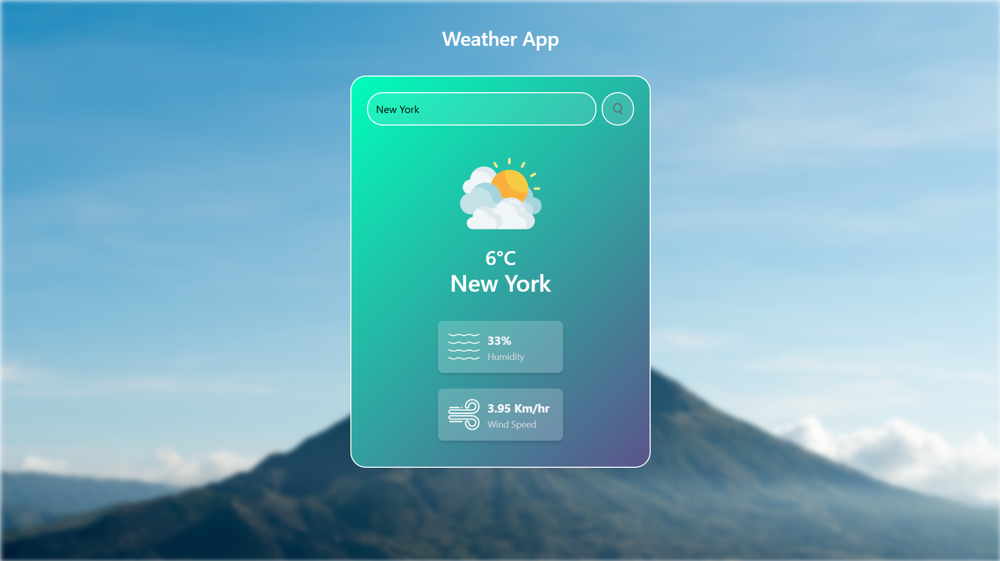

# Weather App

A simple Weather App that fetches and displays real-time weather data using the OpenWeather API.

## Features
- Get current weather information based on city name.
- Displays Temperature, Humidity, and Wind Speed.
- User-friendly UI

## Technologies Used
- **HTML**
- **Tailwind CSS**
- **JavaScript**
- **OpenWeather API**

## API Key Setup
To use this app, you need an API key from OpenWeather.

1. Sign up at [OpenWeather](https://openweathermap.org/api) and get your API key.
2. Replace `YOUR_API_KEY` in the script.js file:
   ```
   const apiKey = 'YOUR_API_KEY';
   ```

## Output Screenshot


---
Made by [Prasad Nayak](https://github.com/PrasadNayak01)